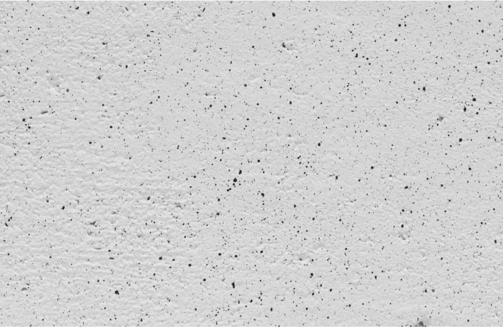
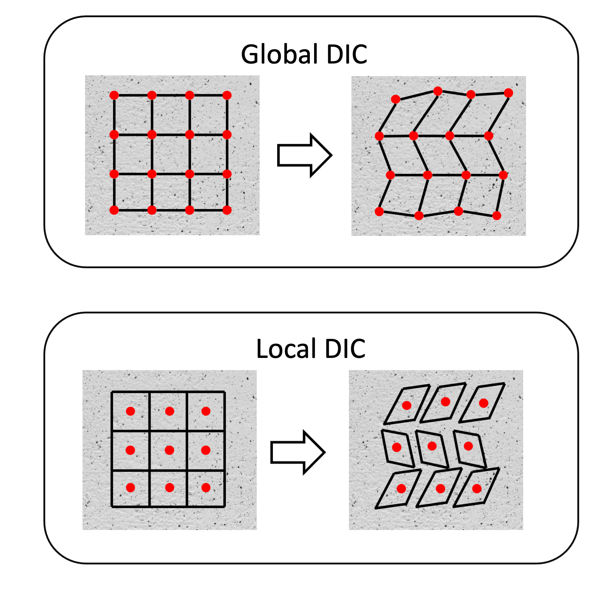
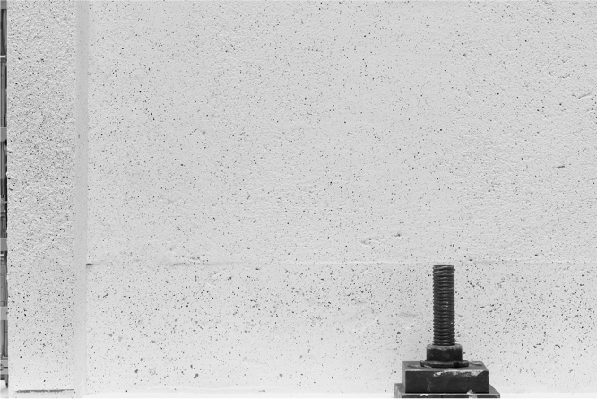
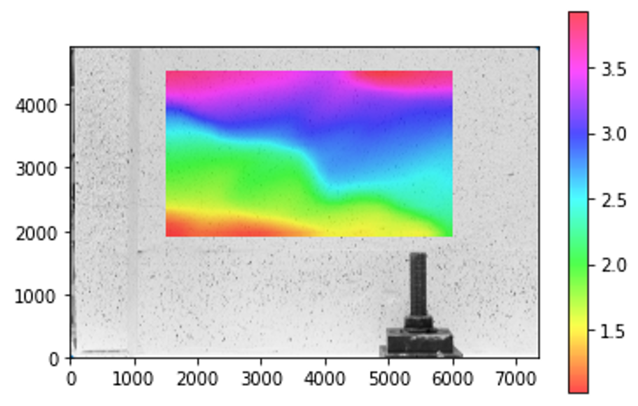

.. _instroduction_doc:

Digital Image Correlation
=========================

Introduction 
-------------

Digital Image Correlation (DIC) is a class of non-contacting methods for extracting strain fields, deformation, and motion of objects by using digital image registration. It is relevant for solving problem in several fields such as in civil engineering [2]_, biomechanics [3]_, and materials science [4]_. In DIC, matching algorithms are used to mesure deformations/motion in solids and fluids; however, in most applications there is a need for measurements in small scales (in the order of mm) and therefore, higher image resolutions are required. To further increase the precision of the measurements, sub-pixel registration algorithms are employed for minimal systematic errors [5]_. In general, DIC can be classified as 2D and 3D [1]_. 2D DIC is focused on the estimation of strain fields in materials by comparing pictures at consecutive load steps. Therefore, matching algorithms are used for maximizing the correlation of patches encoding the local deformation in two dimensions only. On the other hand, 3D DIC consider stereographic images acquired with multiple cameras for estimating the strain fields in three dimensions. Furthermore, a similar approach can be applied for the analysis of volumetric images via digital volume correlation (DVC) [6]_.

2D DIC
_______

The principle of DIC in 2D is based on the comparison of images at two consecutive instants. In particular, one can capture the structural deformation at different load steps to estimate the evolution of the strain field. The correlation is a measure of similarity between signals such as digital images. One of the largely adopted measures of correlation between images is the normalized cross correlation (:math:`C_{NCC}`) [1], which can de defined as

.. math:: C_{NCC} = \frac{(\sum{F - \bar{F})} \sum{(G - \bar{G})}}{\sqrt{\sum{(F - \bar{F})^2} \sum{(G - \bar{G})^2}}} 

where :math:`F` and :math:`G` are the images from which the correlation is computed and the bar over both represent the average of the pixels in the gray scale. Clearly, :math:`C_{NCC}` is maximum (equal to one) when the images :math:`F` and :math:`G` are the same. This quantity is relevant for DIC, however, one can think about some of the possible challenges one can face when searching for the best match for a template in another image. For example, if the values of the magnitude of pixels are the same in a wide area of the searching image, once can end up with a ill-posed problem because the solution cannot be unique. Therefore, there is a need to circumvent this limitation. In the DIC context, a conventional approach consists in add speckles in the object under analysis. These speckles can be applied physically for instance by spraying drops of paint in the object's surface. The objective of creating a speckle pattern in the object surface is that the uniqueness for matching algorithm can be imposed with high probability due to the random characteristics of the speckle pattern, as observed in the following figure.

During an experimental campaign, images are acquired at each load step. These images are then analyzed using an appropriate DIC method for estimating the strain field in the sequence of images. Two classes of methods are the global and local DIC. The global DIC is based on the finite element methodology because it guarantees the global kinematic compatibility and add regularization penalties for reducing noise. On the other hand, the local DIC is based on the template matching methodology, where patches of the reference images are searched in the deformed image. See the difference between these two methods in the following figure.

Next, the local DIC is discussed with more details, including the necessity of using sub-pixel algorithms.

DICpy: Digital Image Correlation with Python
============================================

``DICpy`` (Digital Image Correlation with Python) is a python toolbox containing several algorithms for performing DIC. The algorithms are easily accessible and are useful in several applications. Users can define which one is more suitable for their own applications; moreover, they can fork the GitHub repository to implement their own modifications. However, it is important mentioning that ``DICpy`` is under development, and possible inconsistencies/bugs/errors should be taken into consideration. ``DICpy`` currently contains the module ``DIC_2D`` including the following Python classes:

* ``Images``

The class ``Images`` is used to read the images to be used in the DIC analysis.

* ``RegularGrid``

The class ``RegularGrid`` is used to define the region of interest (ROI) and the grid determining the regions where the image matching is performed. The users have the option to use the mouse by clicking on the image to get the coordinates of points in opposite positions of a rectangle defining ROI. Alternatively, the coordinates can be passed by the user as arguments of the method ``define_mesh``.

* ``Synthetic``

The class ``Synthetic`` can be used to generate synthetic images to test the algorithms implemented in ``DICpy``.

* ``ImageRegistration``

The class ``ImageRegistration`` implements the image matching process with integer resolution.

* ``Oversampling``

The class ``Oversampling`` is used to perform registration with sub-pixel resolution using the oversampling approach to increase the image resolution.

* ``GradientZero``

The class ``GradientZero`` is used to perform registration with sub-pixel resolution using gradient methods. The class implements the method presented in [1] for shape functions with order zero encoding pure translations.

* ``GradientOne``

The class ``GradientOne`` is used to perform registration with sub-pixel resolution using gradient methods. The class implements the method presented in [1] for shape functions with order one encoding shear with affine transformations.

* ``CoarseFine``

The class ``CoarseFine`` is used to perform registration with sub-pixel resolution using gradient methods. The class implements the method presented in [1] for shape functions with zeroth order.

* ``LucasKanade``

The class ``LucasKanade`` implements the Lucas-Kanade method for tracking image features using optical flow. The method uses the method calcOpticalFlowPyrLK() from OpenCV-Python.

Moreover, the following modules contains the implementation of auxiliary methods.

* ``utils``
* ``math4dic``

Local DIC with DICpy
____________________

Local DIC is a method based on template match for estimating the strain fields in materials under deformation. Template matches algorithms can solve this problem by finding the location in the searching image that maximize the correlation, as the normalized cross correlation presented previously, between the template and the searching image. Moreover, algorithms based on the optical flow can be used as well. 

Let's consider the following image of a reinforced concrete wall tested at the Earthquake Engineering and Structural Dynamics Lab at EPFL. 

Two images can be read from a given directory using the class ``Images``, as presented next.

* Instantiate an object of the class Images
 
.. code-block:: python

	imobj = Images()

* Calibrate pixel_dim for conversion pixel/length.

.. code-block:: python

	imobj.calibration(pixel_dim=pixel_length)

* Read the speckle images.

.. code-block:: python

	imobj.read_speckle_images(path=path_to_images, extension="png")

Next, instantiate an object of ``RegularGrid`` with an object of ``Images``.

.. code-block:: python

	meshobj = RegularGrid(images_obj=imobj)

And construct the mesh by giving the extreme points of a rectangular area, and the number of divisions (`nx` and `ny`) per dimension, such as

.. code-block:: python

	meshobj.define_mesh(point_a=(1500,3000), point_b=(6000, 400), nx=30, ny=20, show_grid=False)

Next, run DIC using one of the methods implemented in ``DICpy``. In this example, the Lucas-Kanade algorithm is used using the following commands.

.. code-block:: python

	anaobj = LucasKanade(mesh_obj=meshobj)

and 

.. code-block:: python

	anaobj.run()

Use the class ``PostProcessing`` for plotting the strain fields and displacements. In this example, the horizontal displacement is provided. Moreover, the smoothed graphic is presented because `smooth` is set as True.

.. code-block:: python

	ppobj = PostProcessing(analysis_obj=anaobj)

.. code-block:: python

	ppobj.visualization(results='u', step=1, smooth=True)

Therefore, the following graphic is generated.

.. [1] H. Schreier, J-J Orteu, M. A. Sutton, Image Correlation for Shape, Motion and Deformation Measurements: Basic Concepts,Theory and Applications, ISBN: 978-0-387-78747-3, ed. 1, Springer, Boston, MA.

.. [2] A. Rezaie, R. Achanta, M. Godio, K. Beyer, Comparison of crack segmentation using digital image correlation measurements and deep learning, Construction and Building Materials, 261, 2020, pp. 120474.

.. [3] Y. Katz, Z. Yosibash, New insights on the proximal femur biomechanics using Digital Image Correlation, Journal of Biomechanics, 101, 2020, pp. 109599.

.. [4] S. R. Heinz, J. S. Wiggins, Uniaxial compression analysis of glassy polymer networks using digital image correlation, Polymer Testing, 29(8), 2010, pp. 925-932,

.. [5] B. Pan, B. Wang. Digital Image Correlation with Enhanced Accuracy and Efficiency: A Comparison of Two Subpixel Registration Algorithms. Experimental Mechanics, 56, 2016, pp. 1395–1409.

.. [6] B. K. Bay, T. S. Smith, D. P. Fyhrie et al. Digital volume correlation: Three-dimensional strain mapping using X-ray tomography. Experimental Mechanics 39, 1999, 217–226.

.. toctree::
    :maxdepth: 2

